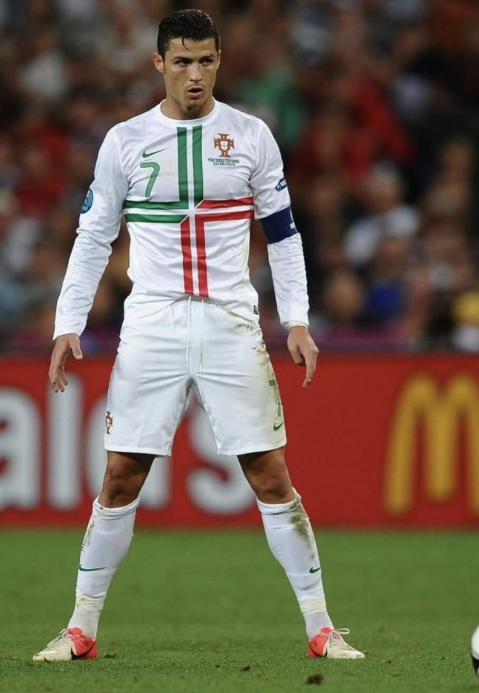
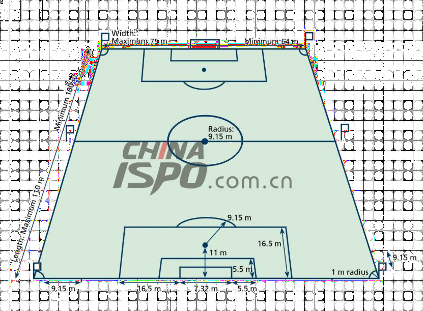

> **Problem A: How to Defend Against a Direct Free-Kick?**

{width="1.6045570866141732in"
height="2.323332239720035in"}

Background
==========

> As the 2026 FIFA World Cup, featuring the USA, Canada, and Mexico, is
> about to kick off, one of the most globally watched sports events,
> every technological breakthrough and tactical innovation on the World
> Cup field has attracted widespread attention. Looking back at the
> history of the World Cup, set-piece plays have always been a crucial
> factor determining the outcome of matches.

The 2018 FIFA World Cup Russia was known as the \"World Cup of
Set-pieces\". Among the total 169 goals scored, 71 originated from
set-pieces, accounting for a high proportion of 42%. All 30
participating teams scored goals through set pieces, and six direct
free-kick goals even set a new high in recent tournaments. Among these,
in the Group B first-round match between Portugal and Spain, Portuguese
star Cristiano Ronaldo scored a direct free-kick in the 87th minute,
directly breaking the goal and leveling the score at 3-3. With this
goal, he completed a hat-trick, and this classic moment has become a
benchmark case for World Cup free-kick tactics.

Requirements
============

This goal by Ronaldo aroused great interest among people after the
match. The goal video and some materials are attached below. Now, please
consider the following questions:

-   Using the video data, attempt to reconstruct the trajectory of this
    > goal in a spatial coordinate system (with the sides of the
    > football field as coordinate axes and the ground as the coordinate
    > plane), and fit the projected curve on the coordinate plane. Is it
    > possible to obtain the initial velocity of the ball?

-   Currently, typical direct free-kick trajectories include the
    > \"banana kick\", \"knuckleball\" (folhaseca), and \"elevator
    > kick\". Establish dynamic mathematical models for these goal
    > trajectories to conduct research and analyze what type of kick
    > this goal belongs to.

-   For players with strong abilities like Cristiano Ronaldo, regarding
    > direct free-kicks in the attacking half, propose a wall strategy
    > and a goalkeeper\'s defensive strategy.

Your PDF solution of no more than 25 total pages should include:

-   One-page Summary Sheet.

-   Table of Contents.

-   Your complete solution.

-   References list.

-   AI Use Report (If used does not count toward the 25-page limit.)

Appendix
========

1.  <http://tv.cntv.cn/video/VSET100389516865/4f2d126dbc2d463e8e5f64e0b578c08e>
    > \[World Cup\] Highlights! Complete Record of All 169 Goals in the
    > 2018 FIFA World Cup Russia!

2.  <http://tv.cntv.cn/video/VSET100389516865/2b632e0dabfe4289a741bdad982bfd5d>
    > \[World Cup\] Panda Talks About Football - Episode 16: Free Kicks

3.  <http://tv.cntv.cn/video/VSET10/30942ecebe4a4a1686a9b2dd9a669486>
    > \[World Cup\] Stunning Long-Range Goals! Top 10 Free Kicks of the
    > 2018 FIFA World Cup Russia

4.  <http://tv.cntv.cn/video/VSET10/84f4216a70c34a1fab34ae02cb8b6a42>
    > \[World Cup\]

The \"Curve Ball\" Makes a Comeback - Breathtaking Free Kick Moments

5.  <http://tv.cntv.cn/video/VSET10/348949a5056344fc9923e248ad21dd72>
    > \[World Cup\] How Impressive Is His Strength? Cristiano Ronaldo
    > Shows Textbook-Level Celebration Moves!

6.  <http://www.lysy360.com/story/28581> What Is the Principle Behind
    > the Knuckleball and Elevator Kick? Tsinghua University Professor
    > Explains with Physics in the Context of Chinese Football\...

7.  <https://video.sina.cn/news/s/2018-06-26/detail-ihencxtu1697923.d.html>
    > Teacher Li Yongle Talks About the World Cup Again - Scientifically
    > Analyzing the Principle of Cristiano Ronaldo\'s Elevator Kick

> **The size of a regular football field:**

The field is 105 meters long and 68 meters wide. Goal: 7.32 meters in
length and 2.44 meters in height;

Penalty area: 40.32 meters in length and 16.5 meters in width, 16.5
meters from the goal post at the baseline.

The small penalty area (goal area) is 18.32 meters long and 5.5 meters
wide, and is

5.5 meters away from the goal post at the baseline. Central circle area:
Radius 9.15 meters;

Corner kick area: Radius 1 meter, 13.84 meters from the penalty area;

{width="4.541666666666667in"
height="3.3399989063867017in"}Penalty arc: A semi-circle with a radius
of 9.15 meters centered on the penalty spot. Penalty spot: 11 meters
from the goal line.
